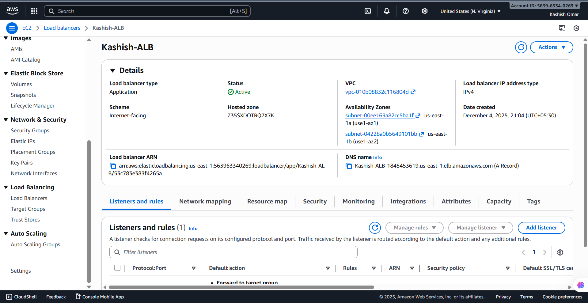
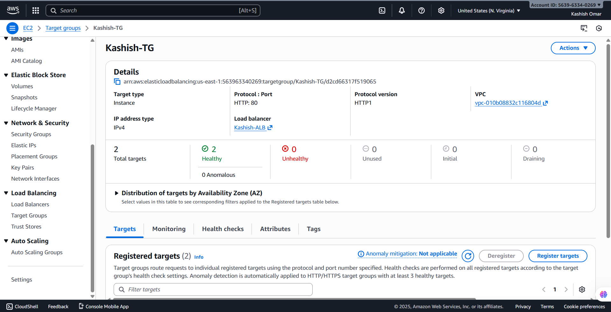
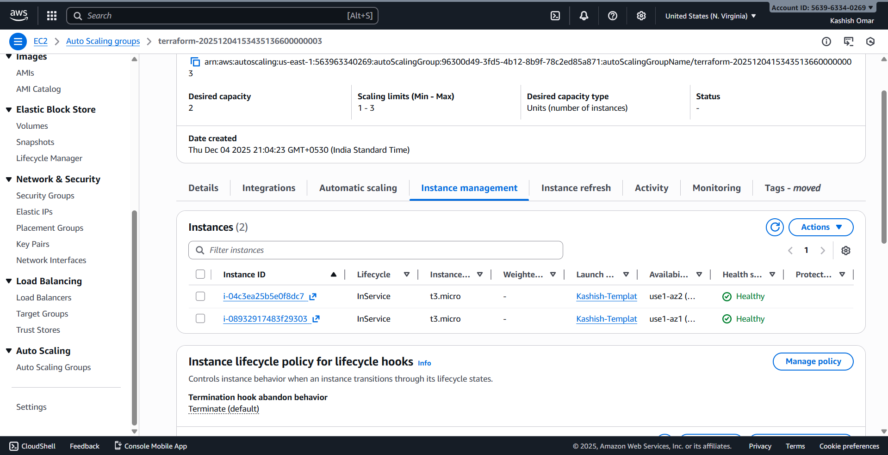
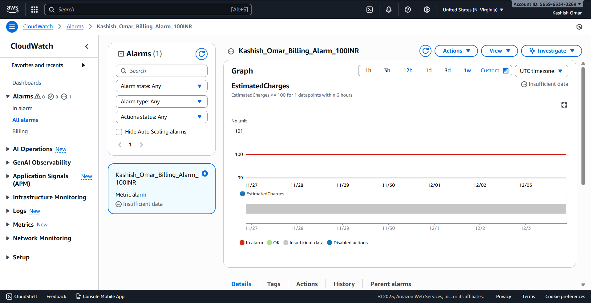
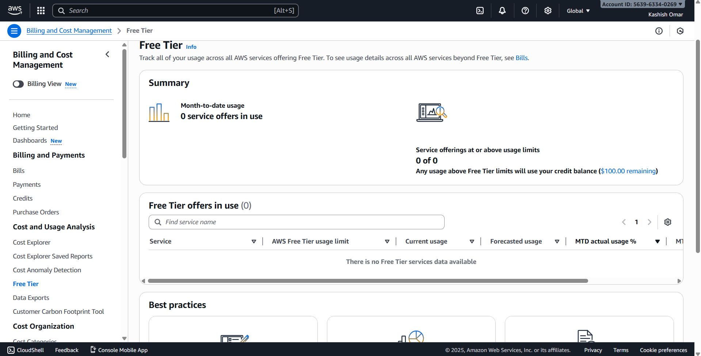

# Flentas Technologies- AWS Technical Assessment - Kashish Omar

## Project Overview
This repository contains the Terraform infrastructure code and architectural designs for a comprehensive AWS Technical Assessment. The project demonstrates proficiency in **Networking**, **Compute**, **High Availability**, **Auto Scaling**, and **Cost Monitoring** using **Infrastructure as Code (IaC)**.

**Author:** Kashish Omar  
**Role:** Full Stack Developer  
**Tools Used:** AWS, Terraform, Nginx, Draw.io

---

## Architecture Design
**Task 5:** High-Level Architecture for a Scalable Web Application (10k Users).


### Key Components:
* **VPC Strategy:** Multi-AZ setup with distinct Public (ALB, NAT) and Private (App, Data) subnets.
* **High Availability:** Auto Scaling Group spanning 2 Availability Zones.
* **Security:** WAF at the edge, private compute instances, and strict Security Groups.
* **Performance:** Application Load Balancer (ALB) for traffic distribution and ElastiCache/Aurora for data efficiency.

---

## Task Breakdown

###  Task 1: Networking & Subnetting
Designed a custom VPC (`10.0.0.0/16`) with a secure tiered architecture.
* **2 Public Subnets:** For NAT Gateway and Load Balancers.
* **2 Private Subnets:** For secure application workloads.
* **Components:** Internet Gateway, NAT Gateway, Route Tables.

**Infrastructure Code:** [View Code](./Task1/main.tf)

<details>
<summary>📸 View Screenshots</summary>


*(Add your subnet/route table screenshots here)*

</details>

---

###  Task 2: EC2 Static Website Hosting
Deployed a public EC2 instance running Nginx to host a static resume.
* **Instance Type:** t3.micro (Free Tier).
* **Automation:** Used `user_data` to install Nginx and generate HTML automatically.
* **Security:** Port 80 (HTTP) open to world; Port 22 (SSH) restricted.

**Infrastructure Code:** [View Code](./Task2/main.tf)

<details>
<summary>📸 View Screenshots</summary>


</details>

---

###  Task 3: High Availability & Auto Scaling
Implemented a production-grade scalable architecture.
* **Load Balancing:** Application Load Balancer (ALB) routing traffic to healthy targets.
* **Auto Scaling:** ASG configured to maintain 2-3 instances based on load.
* **Security:** Instances deployed in **Private Subnets** with no public IPs (accessed only via ALB).

**Infrastructure Code:** [View Code](./Task3/main.tf)

<details>
<summary>📸 View Screenshots</summary>





</details>

---

###  Task 4: Billing & Cost Monitoring
Configured safeguards to prevent unexpected cloud costs.
* **CloudWatch Alarm:** Triggers if estimated charges exceed ₹100 INR.
* **Free Tier:** Enabled Free Tier usage alerts.

**Infrastructure Code:** [View Code](./Task4/main.tf)

<details>
<summary>📸 View Screenshots</summary>




</details>

---

##  How to Run

1.  **Clone the repository:**
    ```bash
    git clone [https://github.com/YOUR_USERNAME/AWS-Technical-Assessment-Kashish.git](https://github.com/YOUR_USERNAME/AWS-Technical-Assessment-Kashish.git)
    cd AWS-Technical-Assessment-Kashish
    ```

2.  **Navigate to a task folder (e.g., Task 1):**
    ```bash
    cd Task1
    ```

3.  **Initialize and Apply Terraform:**
    ```bash
    terraform init
    terraform apply --auto-approve
    ```

4.  **Cleanup (Important):**
    ```bash
    terraform destroy --auto-approve
    ```

---

